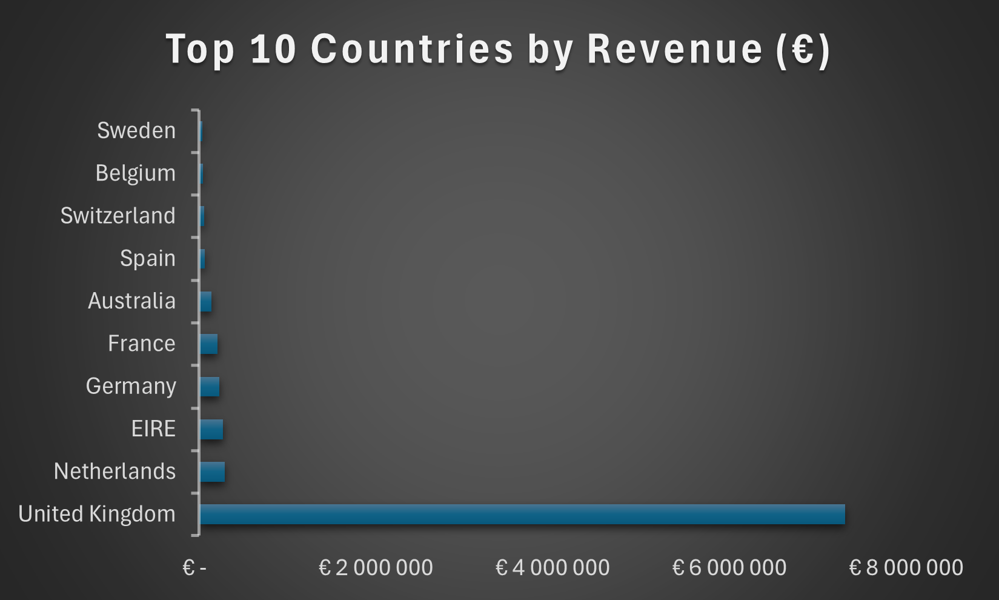
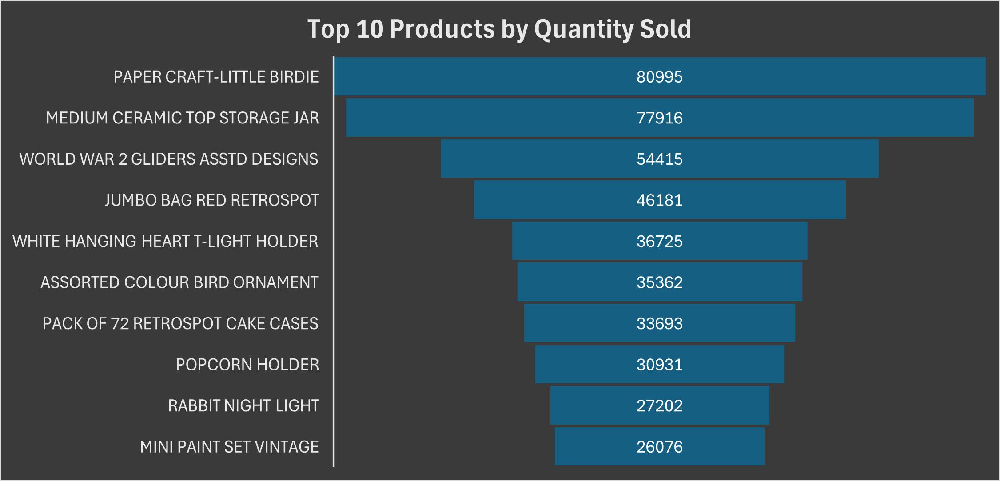
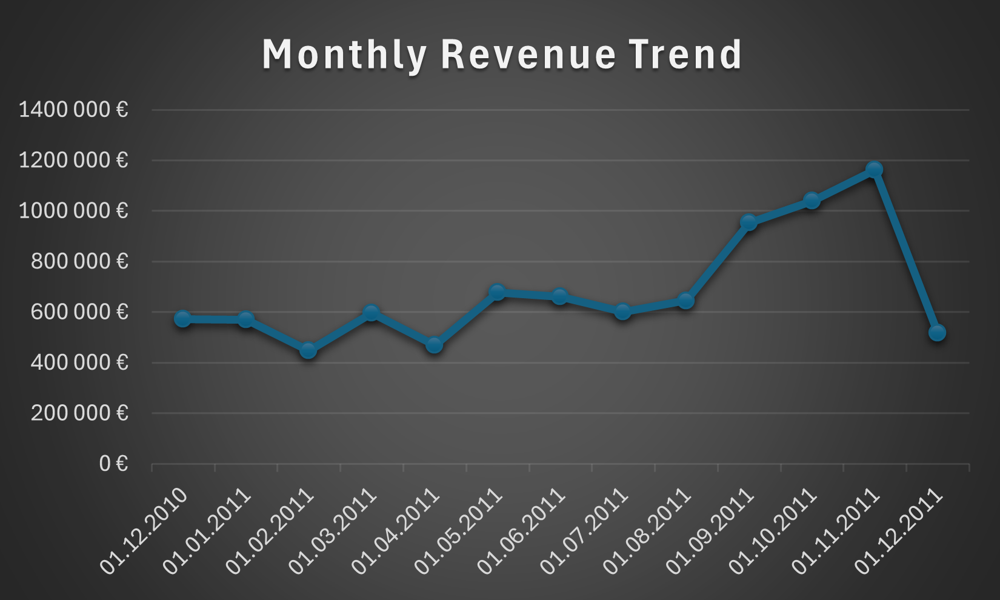

# Online Retail SQL Analysis

## Project Overview
This project analyzes transactional sales data from a **UK-based online retail company** using **PostgreSQL**.  
The goal is to derive clear business insights from raw transaction data by applying **data cleaning**, **aggregation**, and **SQL-based analysis**.

The project is designed as a **portfolio project** to demonstrate practical SQL skills, data understanding, and analytical thinking.

---

## Dataset Description
The dataset represents **online retail transactions from a single company** selling gift and household items.

**Key characteristics:**
- Time period: **2010–2011**
- Customers from **multiple countries**
- Transaction-level data (invoice, product, quantity, price)

**Important note:**  
All results reflect **this specific retailer only**, not total online retail activity per country.

---

## Tools & Technologies
- PostgreSQL
- pgAdmin 4
- SQL
- Git & GitHub
- Excel (for  visualizations)

---
## Project Structure
- online-retail-sql/
- ├─ sql/
- │ ├─ 01_create_table.sql
- │ ├─ 02_modify_tables.sql
- │ ├─ 03_cleaning.sql
- │ └─ 04_analysis.sql
- ├─ README.md
- ├─ .gitignore
- ├─ .gitattributes

---
## Data Cleaning
Before analysis, the dataset was cleaned to ensure reliable results.

**Cleaning steps included:**
- Removing cancelled transactions and returns (quantity ≤ 0)
- Removing invalid prices (unit price ≤ 0)
- Removing records with missing product descriptions
- Handling missing customer identifiers where necessary

After cleaning, the dataset contained **~397,000 valid transactions**.

---

## Analysis & Key Insights

### 1️⃣ Revenue by Country
**Question:**  
Which country generates the highest revenue?

**Result:**  
The **United Kingdom** generates by far the highest revenue, followed by the **Netherlands** and **EIRE**.

**Business Insight:**  
Sales are heavily concentrated in the UK market, indicating strong domestic performance with smaller but notable international demand.

---

### 2️⃣ Most Frequently Sold Products
**Question:**  
Which products are sold most frequently?

**Result:**  
The most frequently sold products include:
- *PAPER CRAFT , LITTLE BIRDIE*
- *MEDIUM CERAMIC TOP STORAGE JAR*
- *WORLD WAR 2 GLIDERS ASSTD DESIGNS*

**Business Insight:**  
High-volume sales are driven by small, decorative, and gift-oriented items, aligning with the retailer’s product focus.

---

### 3️⃣ Revenue Over Time
**Question:**  
How does revenue change over time?

**Result:**  
Revenue remains relatively stable early in 2011, shows strong growth from mid-year onward, peaks in **November 2011**, and declines in December (likely due to incomplete data).

**Business Insight:**  
The retailer experiences clear seasonal demand, with strong performance toward the end of the year.

---

## Key Takeaways
- The UK is the dominant revenue driver for this retailer
- A small number of products account for a large share of total sales volume
- Revenue follows a clear seasonal pattern with year-end peaks

---

## Notes
- This project focuses on **SQL-based analysis**
- Visualizations are used as supporting material only
- Dataset used for **educational and portfolio purposes**